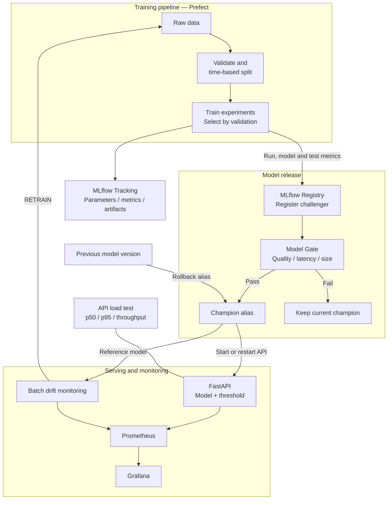

# Fraud Detection MLOps Architecture

## Release behavior

- Pipeline รันการทดลองและเลือกโมเดลจากผล validation
- ประเมินคุณภาพของโมเดลที่เลือกบนชุด test
- แปลง metrics จาก `reports/experiments/best_model.json` ให้ตรงกับ Model Gate
- เติมขนาด artifact หากผลการทดลองยังไม่มี `model_mb`
- ลงทะเบียนโมเดลใหม่เป็น `challenger`
- Gate ตรวจ Recall at Precision >= 0.80, PR-AUC, inference p95 และขนาดโมเดล
- เฉพาะโมเดลที่ผ่านจึงเปลี่ยน alias `champion`
- หาก Gate ไม่ผ่าน จะคง champion เดิมและเก็บ challenger ไว้ตรวจย้อนหลัง
- API โหลดโมเดลและ threshold จาก MLflow run ของ champion
- หลัง promote หรือ rollback ต้อง restart API เพื่อโหลดเวอร์ชันที่เปลี่ยนไป
- Monitoring ส่งสัญญาณ `RETRAIN` เพื่อเรียก training pipeline ตั้งแต่รับข้อมูลใหม่

## Gate thresholds

- `recall_at_p80` >= 0.75
- PR-AUC ต่ำกว่า champion ได้ไม่เกิน 0.005
- inference p95 <= 100 ms
- model artifact <= 50 MB

Inference p95 ที่ใช้ใน Gate เป็นผลวัดของโมเดล
ส่วน API load test วัด latency และ throughput ของระบบให้บริการแยกต่างหาก

## Services and storage

- MLflow UI บนเครื่อง: http://localhost:5001
- API: http://localhost:8000
- Prometheus: http://localhost:9090
- Grafana: http://localhost:3000
- API ภายใน Docker เชื่อม MLflow ผ่าน `http://mlflow:5000`
- MLflow เก็บฐานข้อมูลและ artifacts ใน volume `./mlflow_data:/mlflow`
- MLflow server รับส่ง artifacts ผ่าน `--artifacts-destination`
- Prometheus เชื่อม drift exporter ผ่าน `host.docker.internal:9108`

## Ownership boundaries

| ส่วน | ผู้รับผิดชอบ | ผลลัพธ์หรือหน้าที่ |
|---|---|---|
| Data และ Validation | เปรมสิริวัฒน์ | ตรวจ schema และแบ่ง train/validation/test |
| Feature Pipeline | นาคินทร์ | Transformation ร่วมกันระหว่าง train และ API |
| Model และ Evaluation | สิทธิพงษ์ | MLflow run, ผลทดลอง, threshold และ best_model.json |
| API และ Load Test | สหรัฐ | Prediction API, health, metrics และผล load test |
| Monitoring | โชติกานต์ | Drift metrics, exporter และสัญญาณ RETRAIN |
| Pipeline และ Registry | ธรรมรักษ์ | DAG, Gate, challenger/champion, rollback และ compose |
| CI และ Reproducibility | กันตพัฒน์ | CI checks และตรวจการรันจากเครื่องใหม่ |