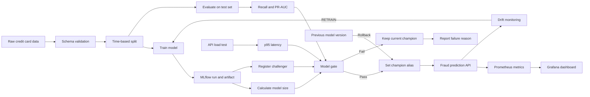

# Fraud Detection MLOps Architecture

## Release behavior

- โมเดลใหม่ถูกลงทะเบียนเป็น `challenger`
- Gate ตรวจ recall, PR-AUC, p95 latency และขนาดโมเดล
- เฉพาะโมเดลที่ผ่านเท่านั้นจึงเปลี่ยน alias `champion`
- โมเดลที่ไม่ผ่านยังคงอยู่ใน Registry เพื่อตรวจย้อนหลัง
- Rollback ย้าย alias `champion` กลับไปยัง version ก่อนหน้า
- Monitoring สามารถส่งสัญญาณ `RETRAIN` เพื่อเริ่ม training pipeline ใหม่

## Ownership boundaries

| ส่วน | ผู้รับผิดชอบ | Output ที่ Pipeline ใช้ |
|---|---|---|
| Data และ Validation | เปรมสิริวัฒน์ | ข้อมูลที่ผ่าน schema และชุด train/validation/test |
| Feature Pipeline | นาคินทร์ | Transformation ที่ใช้ร่วมกันระหว่าง train และ API |
| Model และ Evaluation | สิทธิพงษ์ | MLflow run ID, recall และ PR-AUC |
| API และ Load Test | สหรัฐ | p95 latency และคำสั่ง reload model |
| Monitoring | โชติกานต์ | Drift metrics และสัญญาณ `RETRAIN` |
| Pipeline และ Registry | ธรรมรักษ์ | Gate result, challenger/champion alias และ rollback |