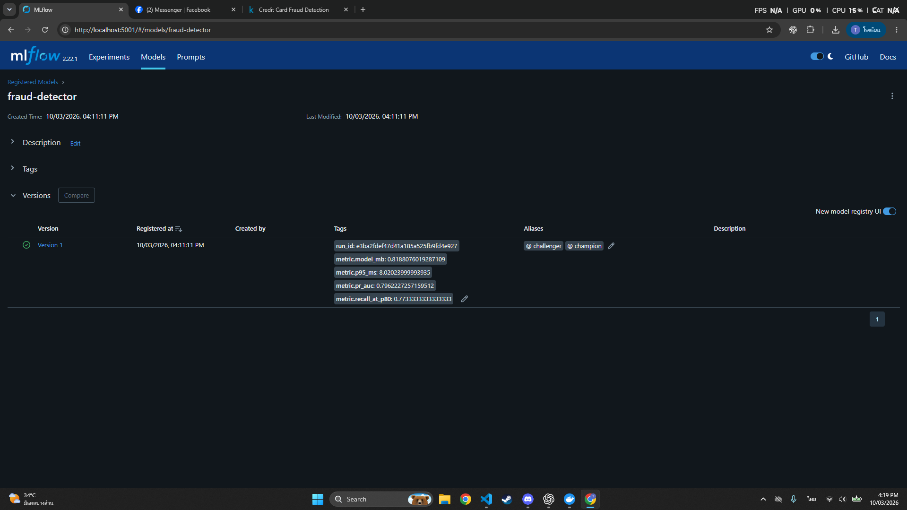
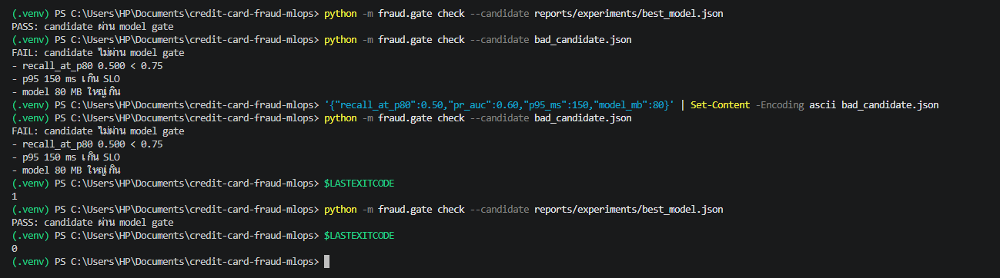
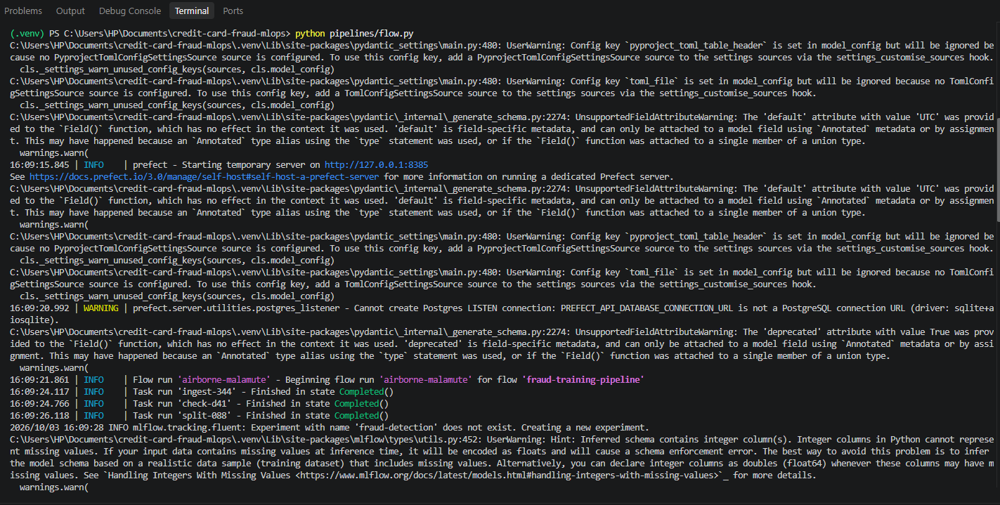
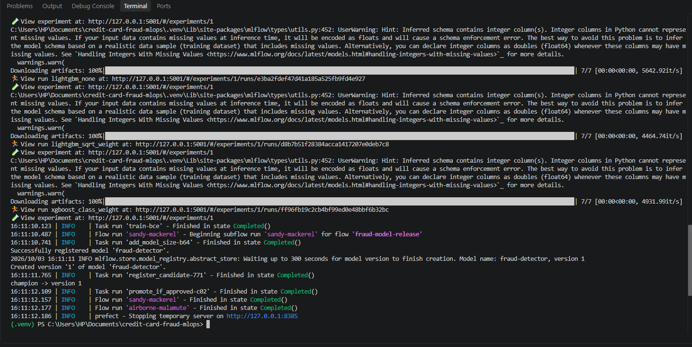
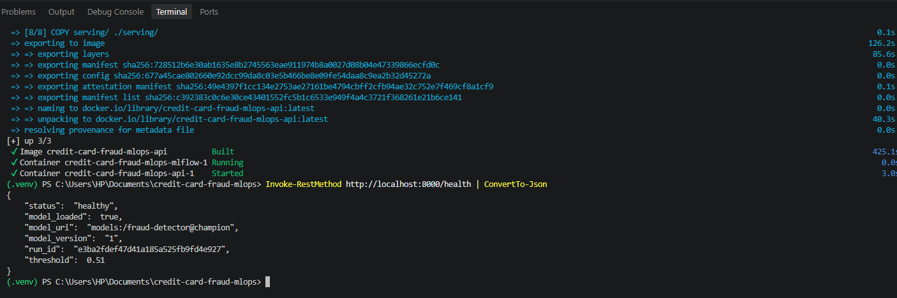
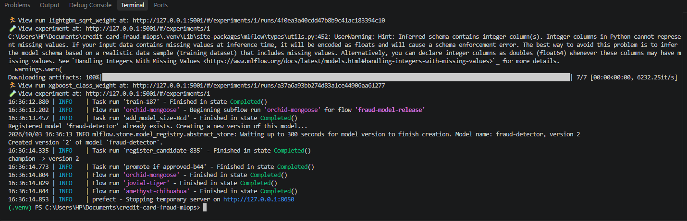
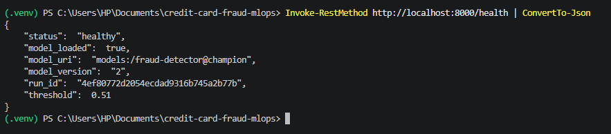
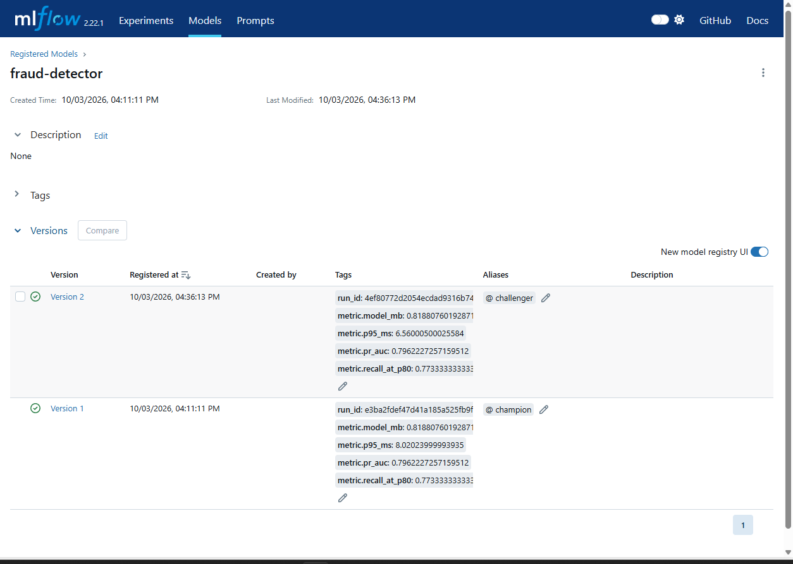
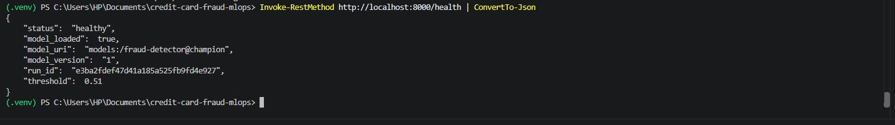

# รายงานส่วน Pipeline และ Model Registry

ผู้รับผิดชอบ: นายธรรมรักษ์  
โครงงาน Credit Card Fraud Detection — กลุ่ม 15 The bid

## 1. หน้าที่และขอบเขตงาน

รับผิดชอบการเชื่อมกระบวนการรับข้อมูล ตรวจคุณภาพ แบ่งชุดข้อมูล
ฝึกและประเมินโมเดล ลงทะเบียนโมเดล ตรวจเกณฑ์คุณภาพ และเลือกโมเดล
สำหรับให้บริการ รวมถึงการย้อนเวอร์ชันและรับสัญญาณฝึกโมเดลใหม่

ไฟล์หลัก ได้แก่ `pipelines/flow.py`, `src/fraud/gate.py`,
`tests/test_flow.py`, `tests/test_gate.py`, `docker-compose.yml`
และเอกสารสถาปัตยกรรมกับ Model Release Contract

## 2. การจัดการโมเดลด้วย MLflow Model Registry

MLflow Tracking บันทึกผลการทดลองและ model artifacts ส่วน Model Registry
จัดเก็บโมเดลชื่อ `fraud-detector` เป็นเวอร์ชัน เพื่อให้ตรวจสอบและย้อนกลับได้

ระบบใช้ alias สองประเภท:

- `challenger`: โมเดลใหม่ที่ลงทะเบียนเพื่อรับการตรวจคุณภาพ
- `champion`: โมเดลที่ผ่านเกณฑ์และถูกเลือกสำหรับให้บริการ

Pipeline ลงทะเบียน candidate เป็น challenger ก่อนตรวจ Gate
หากผ่านจึงย้าย alias champion ไปยังเวอร์ชันใหม่
หากไม่ผ่าน champion เดิมจะยังคงอยู่

API โหลดโมเดลผ่าน URI `models:/fraud-detector@champion`
และอ่าน threshold จาก parameter ของ MLflow run ของโมเดลนั้น
จึงใช้โมเดลและ threshold จากเวอร์ชันเดียวกัน

### เหตุผลที่เลือก MLflow Model Registry

Registry ช่วยจัดการเวอร์ชันโมเดล เชื่อมกลับไปยังผลการทดลอง
และเปลี่ยนโมเดลที่ให้บริการผ่าน alias ได้ โดยไม่ต้องแก้ URI ใน API
ทุกครั้งที่มีโมเดลใหม่ อีกทั้งรองรับการย้อนกลับไปยังเวอร์ชันก่อนหน้า



คำอธิบายภาพ: โมเดลที่ผ่าน Gate ถูกลงทะเบียนเป็น Version 1
และมี alias champion พร้อม metrics ที่ใช้ตรวจคุณภาพ

## 3. Model Gate

Model Gate ตรวจ candidate ก่อนอนุญาตให้เป็น champion
เกณฑ์อ่านจากส่วน `gate` ใน `configs/params.yaml`

| ตัวชี้วัด | เกณฑ์ | จุดประสงค์ |
|---|---|---|
| Recall at Precision >= 0.80 | >= 0.75 | ตรวจพบ fraud ได้เพียงพอภายใต้ข้อจำกัด precision |
| PR-AUC | ต่ำกว่า champion ได้ไม่เกิน 0.005 | ป้องกันคุณภาพลดลงจากโมเดลปัจจุบัน |
| Inference p95 | <= 100 ms | ควบคุมเวลา inference ของโมเดล |
| Model artifact size | <= 50 MB | ควบคุมขนาดโมเดลที่นำไปใช้งาน |

ข้อมูลต้องมี `recall_at_p80`, `pr_auc`, `p95_ms` และ `model_mb`
ครบทั้งสี่ค่า หากขาดค่าใดจะไม่ผ่าน Gate

Pipeline แปลง metrics จาก `reports/experiments/best_model.json`
เป็นชื่อที่ Gate ใช้ เช่น `test_recall_at_p80` เป็น `recall_at_p80`

ค่า Recall at Precision >= 0.80 เป็นตัวชี้วัดสำหรับตรวจคุณภาพ
ส่วน threshold ที่ใช้ทำนายจริงอ่านจาก MLflow run ของ champion
สำหรับโมเดลที่ใช้สาธิต threshold เท่ากับ 0.51

Inference p95 ของโมเดลเป็นคนละการวัดกับ API load test
ซึ่งวัด latency และ throughput ของระบบให้บริการ

### ผลการทดสอบ Gate

ทดสอบกรณีไม่ผ่านด้วย candidate ต่อไปนี้:

```json
{
  "recall_at_p80": 0.50,
  "pr_auc": 0.60,
  "p95_ms": 150,
  "model_mb": 80
}
```

ค่าดังกล่าวไม่ผ่านเกณฑ์ recall, latency และขนาดโมเดล
คำสั่ง CLI แสดง FAIL พร้อมเหตุผลและคืน exit code 1

จากนั้นตรวจ candidate จริงจาก `best_model.json`
ผลเป็น PASS และคืน exit code 0

คำสั่ง CLI `check` ตรวจ metrics เท่านั้น
ส่วนการลงทะเบียนและเลื่อน alias ทำใน release pipeline



คำอธิบายภาพ: Candidate ที่มีคุณภาพต่ำกว่าเกณฑ์ถูกปฏิเสธ
ส่วน candidate จริงผ่าน Gate โดยมี exit code ยืนยันทั้งสองกรณี

## 4. Pipeline ด้วย Prefect

Pipeline ใช้ Prefect จัดลำดับงานและติดตามสถานะของแต่ละ task
โดยแบ่งเป็นขั้นตอนดังนี้:

1. Ingest: โหลดข้อมูลดิบและคำนวณ data version จาก hash
2. Check: ตรวจข้อมูลด้วย raw validation
3. Split: แบ่ง train/validation/test ตามเวลา
4. Train: รันการทดลองและเลือกโมเดลจาก validation
5. สร้างรายงานและ candidate metrics จากโมเดลที่เลือก
6. Add model size: เติมขนาด artifact หากยังไม่มี
7. Register candidate: ลงทะเบียน challenger
8. Promote if approved: ตรวจ Gate และย้าย alias champion เมื่อผ่าน

เลือกโมเดลจาก validation ส่วนผล test ใช้ประเมินและตรวจ Gate
โดยผลการทดลองถูกบันทึกใน MLflow และไฟล์รายงาน

### เหตุผลที่เลือก Prefect

Prefect แสดงสถานะของ flow และ task ทำให้ทราบว่ากระบวนการสำเร็จ
หรือหยุดที่ขั้นใด และแยก training flow ออกจาก release flow ได้
จึงช่วยติดตามการทำงานและหาสาเหตุเมื่อเกิดความล้มเหลว

### คำสั่งรัน

```powershell
python pipelines/flow.py
```

คำสั่งที่เทียบเท่าเมื่อมี Make:

```text
make all
```

### ผลการรันจริง

การสาธิตวันที่ 3 ตุลาคม 2569 ใช้ข้อมูล `creditcard.csv`
และ MLflow server ที่รันใน Docker

Pipeline รัน ingest, check, split, train และ release สำเร็จ
เลือกโมเดล `lightgbm_none` และสร้าง `fraud-detector` Version 1
พร้อมย้าย alias champion ไปยังเวอร์ชันนี้

ผลที่บันทึกใน Registry ของ Version 1:

| ตัวชี้วัด | ผลโดยประมาณ |
|---|---|
| Recall at Precision >= 0.80 | 0.7733 |
| PR-AUC | 0.7962 |
| Inference p95 | 8.02 ms |
| Model artifact size | 0.819 MB |

ค่าดังกล่าวผ่านเกณฑ์ของ candidate ทั้งหมด
ในการรันครั้งแรกยังไม่มี champion เดิมสำหรับเปรียบเทียบ PR-AUC

เวลา inference เป็นผลวัดจากเครื่องที่ใช้สาธิต
และอาจเปลี่ยนตามภาระงาน



คำอธิบายภาพ: Training pipeline เริ่มทำงาน
และขั้น ingest, check และ split จบด้วยสถานะ Completed



คำอธิบายภาพ: ขั้น train และ release สำเร็จ
Registry สร้าง Version 1 และระบบเลื่อนเป็น champion
โดย flow จบด้วยสถานะ Completed

## 5. การเชื่อม MLflow และ API ผ่าน Docker Compose

ปรับ MLflow server ให้รับส่ง artifacts ผ่าน
`--artifacts-destination /mlflow/artifacts`
เพื่อให้ client บน Windows ส่งโมเดลไปเก็บผ่าน server
และให้ API ใน container โหลดโมเดลจาก Registry ได้

ฐานข้อมูลและ artifacts เก็บผ่าน volume `./mlflow_data:/mlflow`
โดยใช้ SQLite URI `sqlite:////mlflow/mlflow.db`

พอร์ต 5000 บนเครื่องที่สาธิตไม่สามารถเปิดใช้งานได้
จึงกำหนด port mapping เป็น `5001:5000`
API ภายใน Docker ยังคงเชื่อมผ่าน `http://mlflow:5000`

ตั้งค่า client ใน PowerShell:

```powershell
$env:MLFLOW_TRACKING_URI="http://127.0.0.1:5001"
```

เพิ่ม `host.docker.internal:host-gateway` ให้ Prometheus
เพื่อรองรับการเชื่อม drift exporter บนเครื่อง host
การตรวจนี้ยืนยันการตั้งค่า Compose
ส่วนผลการทำงานของ exporter และ dashboard อยู่ในรายงาน monitoring

### ผลการตรวจ API

หลังสร้าง champion และเปิด API ผล `/health` แสดงว่า:

- status เป็น healthy
- model_loaded เป็น true
- model_version เป็น 1
- threshold เป็น 0.51

ผลนี้ยืนยันว่า API โหลด champion และ threshold จาก MLflow ได้



## 6. การรับสัญญาณ RETRAIN

ระบบรองรับคำสั่งฝึกใหม่เมื่อได้รับสัญญาณ RETRAIN:

```powershell
python pipelines/flow.py --signal RETRAIN
```

คำสั่งที่เทียบเท่าเมื่อมี Make:

```text
make retrain
```

เมื่อได้รับ RETRAIN จะเรียก training pipeline ตั้งแต่รับข้อมูล
จนถึงการตรวจ Gate หากผ่านจึงเลื่อนโมเดลใหม่เป็น champion
หากไม่ผ่านจะคง champion เดิม

ในการสาธิต เรียก RETRAIN แล้วสร้าง Version 2 สำเร็จ
พร้อมข้อความ `champion -> version 2` และ flow จบด้วยสถานะ Completed



คำอธิบายภาพ: การเรียกด้วยสัญญาณ RETRAIN
สร้างโมเดลเวอร์ชันใหม่ ผ่าน Gate และเปลี่ยน champion เป็น Version 2

การสาธิตนี้ยืนยันการรับสัญญาณ RETRAIN ผ่านคำสั่ง CLI
ส่วนหลักฐานที่ monitoring ตรวจพบ drift และส่งสัญญาณจริง
ต้องนำมาประกอบจากส่วนงาน monitoring

## 7. การสาธิต Rollback

Rollback ย้าย alias champion กลับไปยังเวอร์ชันก่อนหน้า
โดยไม่ต้องฝึกโมเดลใหม่

ในการสาธิตมีโมเดลสองเวอร์ชัน:

- Version 1: จากการรัน pipeline ครั้งแรก
- Version 2: จากการรันด้วยสัญญาณ RETRAIN

เริ่มจาก restart API ให้โหลด Version 2 และตรวจ `/health`
จากนั้นย้อน champion ไป Version 1:

```powershell
python -m fraud.gate rollback 1
```

ตรวจใน MLflow ว่า alias champion อยู่ที่ Version 1
แล้ว restart API:

```powershell
docker compose restart api
```

หลัง API พร้อม ตรวจ `/health` อีกครั้ง พบว่า model_version
เปลี่ยนจาก 2 เป็น 1 และ run_id กลับเป็น run ของ Version 1
ขณะที่ status ยังเป็น healthy และ threshold เท่ากับ 0.51

โมเดลทั้งสองเวอร์ชันในการสาธิตมี threshold เท่ากัน
จึงใช้ model_version และ run_id เป็นหลักฐานยืนยันการย้อนกลับ



คำอธิบายภาพ: ก่อน rollback API โหลด champion Version 2 สำเร็จ



คำอธิบายภาพ: หลัง rollback alias champion ใน Registry
ชี้กลับไปยัง Version 1



คำอธิบายภาพ: หลัง restart API ระบบกลับมาใช้ Version 1
และ run_id ของโมเดลเดิม โดยสถานะยังเป็น healthy

### ข้อจำกัดปัจจุบัน

API โหลดโมเดลและ threshold ตอนเริ่ม service
หลัง promote หรือ rollback จึงต้อง restart API
เพื่อใช้ champion ที่เปลี่ยนไป

## 8. หลักฐานและการทำงานร่วมกัน

งานแก้ Docker Compose และเอกสารส่งผ่าน branch
`fix/compose-mlflow-artifacts` และ
[Pull Request #23](https://github.com/sitthiphongn-sudo/credit-card-fraud-mlops/pull/23)

ก่อนส่งงานตรวจ `docker compose config --quiet` ผ่าน
และทดสอบ pipeline, API health, Gate, RETRAIN และ rollback จริง

PR #23 ผ่าน CI ทั้ง 3 checks แล้ว
สถานะการ approve และ merge จะบันทึกเพิ่มเติมเมื่อดำเนินการเสร็จ

## 9. การใช้ AI

ใช้ Codex ช่วยเสนอการปรับ configuration และเอกสาร
อธิบายคำสั่ง และแนะนำจุดเก็บหลักฐาน

ผู้รับผิดชอบลงมือแก้ไฟล์ รันคำสั่ง ตรวจผล และเก็บภาพด้วยตนเอง
พร้อมบันทึกการใช้งานใน `AI_USAGE.md`