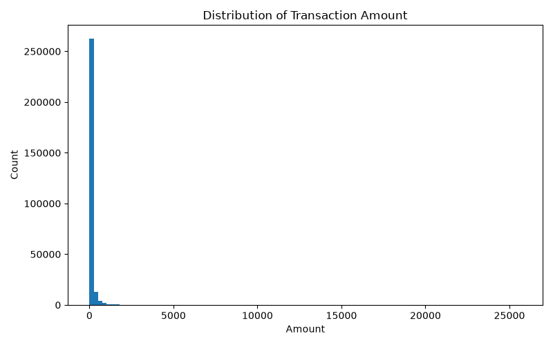
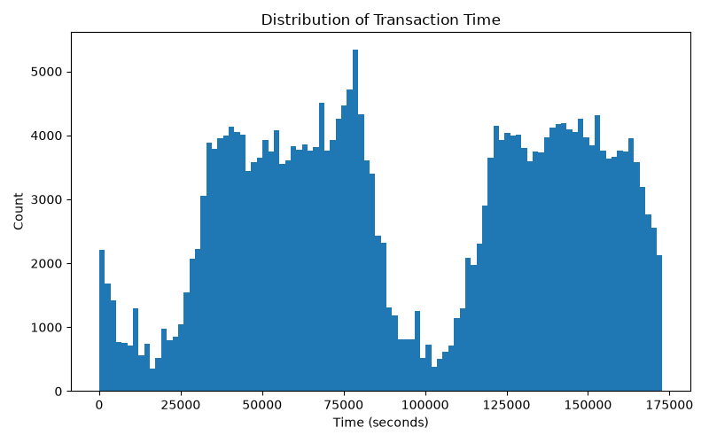
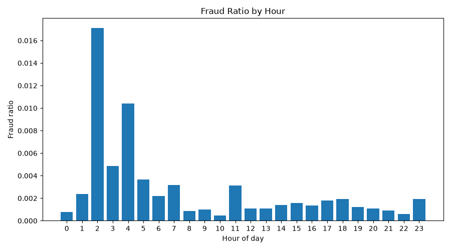
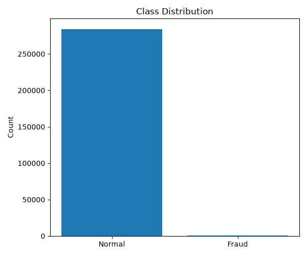

# Exploratory Data Analysis

## Dataset summary

- Total rows: 284,807
- Fraud rows: 492
- Fraud ratio: 0.172749%
- Duplicate rows: 1,081
- Rows with Amount = 0: 1,825

## Observations

### Class imbalance

The dataset is highly imbalanced. Fraud transactions represent only
0.172749% of all transactions.

### Duplicate rows

There are 1,081 duplicated rows in the complete dataset.

For the project, duplicated rows will be removed only from the training
set to reduce the chance that the model memorizes repeated transactions.
Duplicates will remain in validation and test data so those sets better
represent incoming real-world data.

### Amount

The transaction amount distribution is strongly right-skewed. Most
transactions have relatively small amounts, while a small number of
transactions have very large values.

### Time

The Time column records elapsed seconds. Transaction activity is not
uniform across time.

### Fraud by hour

Fraud ratio varies by hour. The hourly ratio is calculated as the number
of fraudulent transactions divided by the total number of transactions
within each hour.

## Figures

